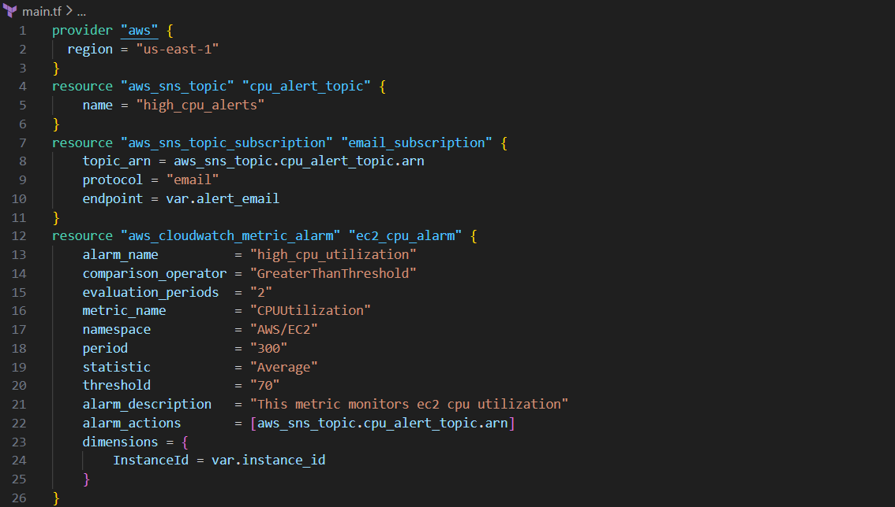
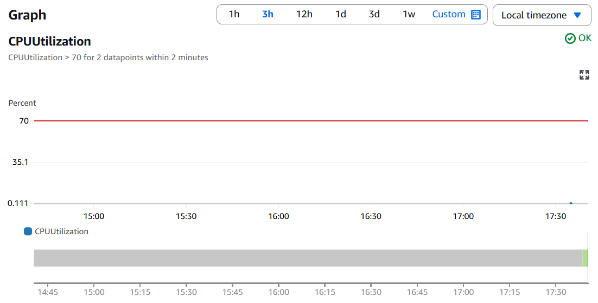
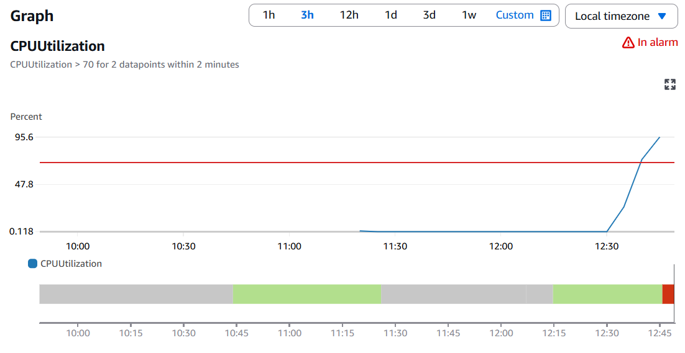
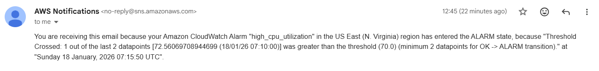

# AWS Monitoring & Audit System (IaC)

## 🎯 Project Overview
In a production cloud environment, high CPU utilization can lead to application latency or total system failure. I developed an automated **Monitoring & Alerting System** that uses Infrastructure as Code (IaC) to ensure administrators are notified immediately when system health is at risk.

## 🏗️ Technical Architecture
I used **Terraform** to provision a modular architecture consisting of:
* **Amazon EC2:** Hosting the core workload.
* **CloudWatch Alarms:** Monitoring `CPUUtilization` with a 70% threshold.
* **Amazon SNS:** Acting as the communication bridge to send alerts.

## 🛠️ Infrastructure as Code
Instead of manual configuration, I defined the entire stack in Terraform. This ensures the environment is reproducible and version-controlled.

*Figure 1: Terraform configuration defining the Alarm and SNS Subscription.*

---

## 🧪 Validation & Proof of Work
To test the reliability of the system, I performed a stress test on the instance.

### Step 1: Baseline State
Initially, the system was in a healthy state with minimal CPU usage.

### Step 2: Triggering the Alarm
I connected to the instance via SSH and ran the `stress` utility. This pushed the CPU utilization past the 70% limit, causing the alarm to transition to the **ALARM** state.

### Step 3: Real-Time Notification
Within minutes of the breach, the SNS service successfully delivered a high-priority alert to my inbox.

---

## 📈 Key Skills Demonstrated
* **Observability:** Setting up meaningful metrics and thresholds.
* **Automation:** Using Terraform to eliminate manual "click-ops."
* **Linux Administration:** Using CLI tools like `stress` to validate cloud behavior.
* **Troubleshooting:** Debugging metric reporting and SNS subscription status.

---
